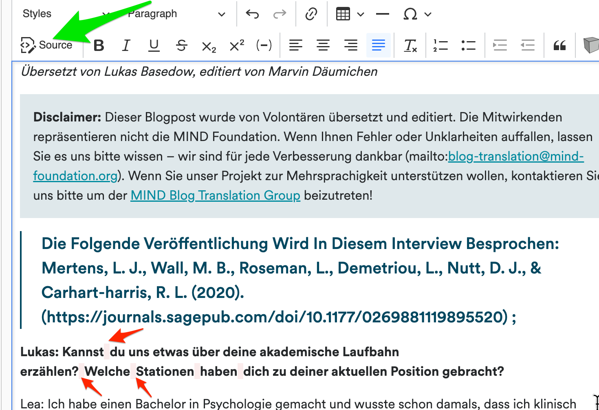
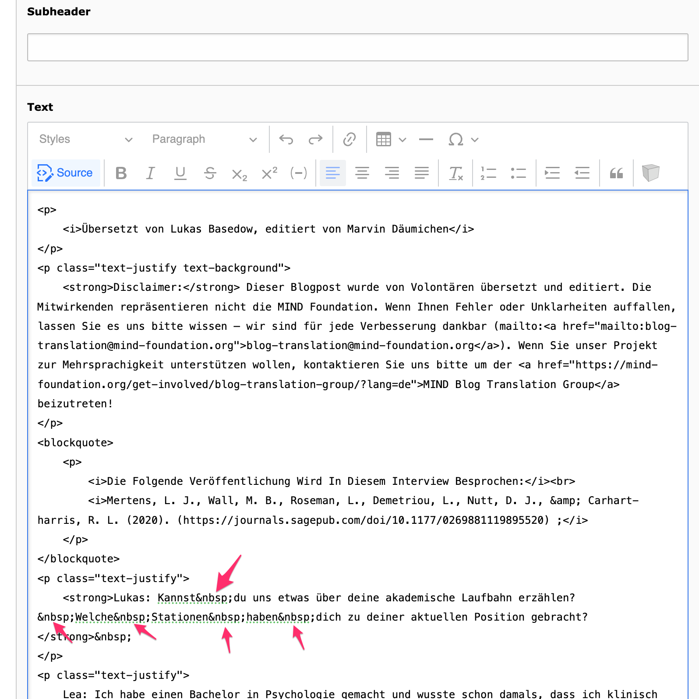
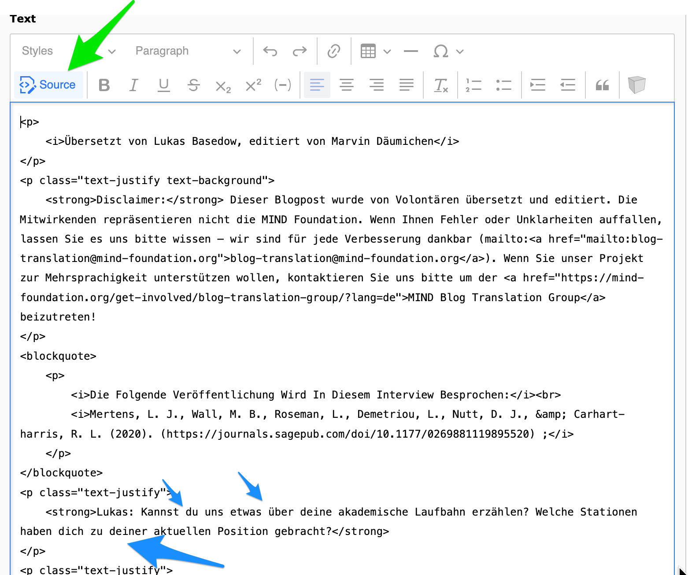
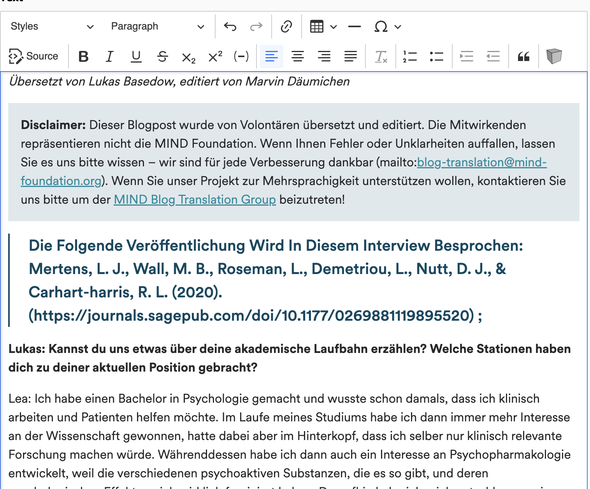

# problem

for anyone having fun with the [non breaking spaces](https://mailtrap.io/blog/nbsp/) - yannow the bright pinky ones :) i found a way to quickly replace all of them with the help of a text editor.

# solution

here is a text, which has over a hundred of them. 

1. so, from the rendered view, you switch to the underlying html source code of the page

2. which looks like this. note that our beloved non-breaking spaces have a symbol in html, which is `&nbsp;` - starting with an ampersand, ending with a semicolon.

3. you take the entire source code from the box and copy it, open it in a text editor which can handle search and replace (windows notepad, sublime, notepad++, visual studio code...) or simply use the web version of visual studio code (https://vscode.dev/) and create a new file there, paste the source code in it

4. then replace all the `&nbsp;` by a single whitespace / spacebar.

5. copy the entire html code back into the source code view in typo3

6. switch back to visual view

